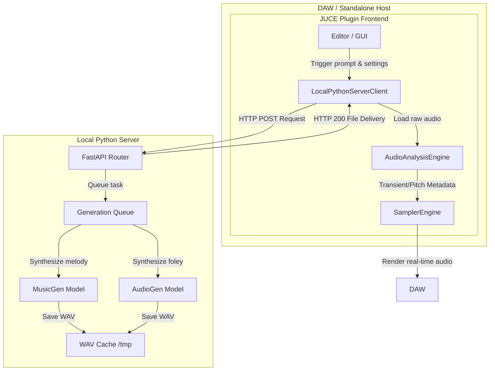

# ARCHITECTURE.md - System Design & Class Hierarchy

## 1. System Topology & Infrastructure

The system is designed as a hybrid client-server application. 
- **Frontend (Client):** A C++ JUCE plugin compiled as VST3, AU, or Standalone. It handles real-time MIDI parsing, dual-layer sample playback (DSP), offline audio analysis, and user interactions.
- **Backend (Server):** A local Python FastAPI server running in a background process. It hosts deep learning models (Meta AudioCraft: MusicGen and AudioGen) to generate audio files asynchronously.



---

## 2. API Abstraction Layer

To ensure future-proofing (e.g., swapping the local server for OpenAI's Sora, ElevenLabs, or Stable Audio API), the network connection is entirely decoupled using C++ interfaces.

```cpp
struct PromptConfig {
    juce::String prompt;
    int noteCount;
    int octaves;
    int foleyCount;
    float temperature;
};

struct AudioResult {
    juce::File audioFile;
    juce::String rawPrompt;
};

class AudioGeneratorAPI {
public:
    virtual ~AudioGeneratorAPI() = default;
    
    using TonalCallback = std::function<void(const std::vector<AudioResult>&, juce::String errorMessage)>;
    using FoleyCallback = std::function<void(const std::vector<AudioResult>&, juce::String errorMessage)>;

    virtual void generateTonalSamples(const PromptConfig& config, TonalCallback callback) = 0;
    virtual void generateFoleySamples(const PromptConfig& config, FoleyCallback callback) = 0;
};
```

---

## 3. Audio Analysis Pipeline (DSP)

When raw `.wav` files are delivered from the API, they pass through a strict offline analysis pipeline.

### 3.1. Transient Detection & Auto-Cropping
- **Algorithm:** RMS Energy envelope tracking combined with High-Frequency Content (HFC) or Spectral Flux to capture sharp changes in spectral energy.
- **Formulas (Spectral Flux):**
  $$SF(n) = \sum_{k=0}^{N-1} H(|X(n, k)| - |X(n-1, k)|)$$
  Where $H(x) = \frac{x + |x|}{2}$ is a half-wave rectifier, and $X(n, k)$ represents the STFT magnitude of bin $k$ at frame $n$.
- **Zero-Crossing Snapping:** Once a transient onset index $t_{onset}$ is detected, the engine searches forward/backward in the raw PCM buffer for the nearest zero-crossing point:
  $$x(i) \cdot x(i-1) \le 0$$
  This snaps the start crop marker to $i$ to prevent phase discontinuities and unwanted audio pops.

### 3.2. Pitch Detection & Auto-Tuning
- **Algorithm:** **YIN Algorithm** (or McLeod Pitch Method) for robust fundamental frequency ($f_0$) estimation in monophonic tonal sounds.
- **YIN Phases:**
  1. *Cumulative Mean Normalized Difference Function:* Calculates difference over lags $\tau$.
  2. *Absolute Thresholding:* Selects the lowest lag $\tau$ that drops below a set threshold (e.g., 0.1) to avoid sub-harmonic doubling.
  3. *Parabolic Interpolation:* Refines the pitch estimation between discrete buffer indices.
- **Auto-Tuning Mapping:**
  $$f_0 \to \text{MIDI Note Number} = 12 \cdot \log_2\left(\frac{f_0}{440}\right) + 69$$
  $$\text{Offset Cents} = 1200 \cdot \log_2\left(\frac{f_0}{f_{\text{target}}}\right)$$
  The offset is registered in cents, which is used to calculate the resample ratio or playback speed correction in the playback engine.

### 3.3. Time-Stretching & Pitch-Shifting (RubberBand)
- Pitch-shifting via traditional resampling changes the duration of the sample (producing the "chipmunk effect").
- To preserve the natural decay, we integrate **RubberBand Library** (an exceptionally high-quality commercial/open-source phase-vocoder with transient-shaping).
- **CPU Mitigation Strategy (Offline Rendering):** Running RubberBand in real-time inside the JUCE audio thread is CPU-heavy and unsafe for low buffer sizes. 
  * *Solution:* When a sample is loaded, we spawn a background worker thread (`RubberBandStretcherJob`) that pre-renders pitch-shifted and time-stretched versions of the sample for the designated key-ranges, saving them into temporary RAM buffers. Real-time playback is then a simple, glitch-free linear or Lagrange interpolation reader.

---

## 4. Playback Sampler Engine

The synthesizer engine manages two custom synthesiser layers.

```
                  +-----------------------+
                  |     SamplerEngine     |
                  +-----------+-----------+
                              |
              +---------------+---------------+
              |                               |
    +---------v---------+           +---------v---------+
    |   SamplerLayerA   |           |   SamplerLayerB   |
    | (Tonal Playback)  |           | (Foley/Mechanics) |
    +---------+---------+           +---------+---------+
              |                               |
    +---------v---------+           +---------v---------+
    |  SamplerVoiceA    |           |  SamplerVoiceB    |
    |  - RubberBand     |           |  - Round-Robin    |
    |  - ADSR Envelope  |           |  - Note On/Off    |
    +-------------------+           +-------------------+
```

### 4.1. Layer A: Tonal Playback
- **Class:** `SamplerLayerA` (inherits from `juce::Synthesiser`).
- **Sound Mapping:** `SamplerSoundA` represents a tonal sample, storing:
  - Root MIDI key.
  - Fine-tune cent adjustments.
  - Active crop start/end points (snapped).
  - Dedicated ADSR parameter values.
- **Voice Playback:** `SamplerVoiceA` reads the pre-rendered/interpolated RubberBand buffer.

### 4.2. Layer B: Foley & Mechanical FX
- **Class:** `SamplerLayerB` (inherits from `juce::Synthesiser`).
- **Trigger Modes:**
  - `Note-On`: Sound is played immediately when a MIDI key is pressed.
  - `Note-Off`: Sound is played when the key is released (perfect for key release/damper noises).
- **Velocity Mapping:** A single foley zone can contain multiple WAVs mapped to different velocity layers (e.g., quiet key-press vs. hard strike).
- **Round-Robin & Randomization:**
  - Prevents repetitive, mechanical "machine-gun" artifacts.
  - `SamplerVoiceB` maintains a list of alternate samples for a single zone. When triggered, it cycles through them (`Round-Robin`) or uses a pseudo-random selection with a "no-repeat-twice" rule.

---

## 5. JUCE C++ Class Hierarchy

The entire codebase is structured inside clear modules under the namespace `ingen`.

### 5.1. DSP & Analysis Modules
- `class TransientDetector`
  - `std::pair<int, int> detectTransientAndZeroCrossings(const juce::AudioBuffer<float>& buffer, float threshold)`
- `class PitchDetector`
  - `float estimateFundamentalFrequency(const juce::AudioBuffer<float>& buffer, double sampleRate)`
- `class RubberBandWrapper`
  - Encapsulates `rubberband::RubberBandStretcher` for pre-rendering pitch shifts.

### 5.2. Network & API Modules
- `class AudioGeneratorAPI` (Interface)
- `class LocalPythonServerClient : public AudioGeneratorAPI, private juce::Thread`
  - Inherits from `juce::Thread` to handle background polling and networking without blocking the UI thread.

### 5.3. Sampler Engine Modules
- `class SamplerSoundBase : public juce::SynthesiserSound`
- `class SamplerSoundA : public SamplerSoundBase`
  - Contains ADSR parameters, pitch-tuning metadata, and wave crop points.
- `class SamplerSoundB : public SamplerSoundBase`
  - Contains velocity zone mapping, trigger mode (On/Off), and Round-Robin index.
- `class SamplerVoiceA : public juce::SynthesiserVoice`
  - Playback engine with ADSR envelope generator (`juce::ADSR`).
- `class SamplerVoiceB : public juce::SynthesiserVoice`
  - Foley sound trigger.
- `class SamplerEngine`
  - Holds `SamplerLayerA` and `SamplerLayerB`.
  - Coordinates GUI calls, preset loading, and MIDI routing.
  - Houses the `LayerLinker` to coordinate preset sync or decoupled routing.

### 5.4. Preset & IO Modules
- `class PresetSerializer`
  - Serializes state into JSON formats.
- `class PresetArchiver`
  - Handles zipping of audio assets and JSON metadata into a single `.ingsam` archive.

### 5.5. GUI Modules
- `class MainProcessorEditor : public juce::AudioProcessorEditor`
- `class WaveformVisualizer : public juce::Component`
  - Visualizes sample waveforms, crop boundaries, and transient markers. Supports interactive click-drag for manual marker adjustments.
- `class PromptPanel : public juce::Component`
  - Prompt text editor, sliders for parameters (Notes count, octaves, temperature).
- `class ADSRPanel : public juce::Component`
  - Knobs mapping ADSR parameters.
